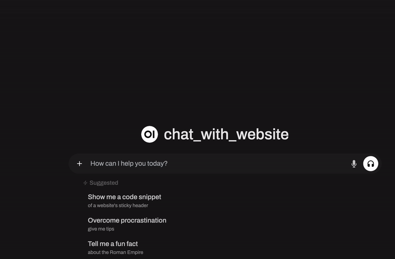
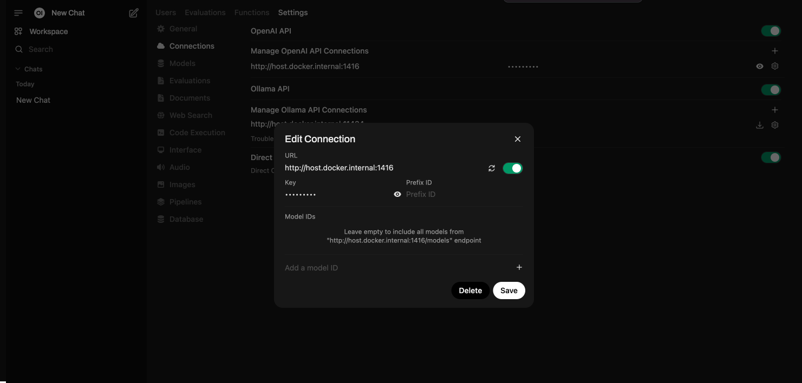

# Chat with a Website using Hayhooks and Open WebUI

This demo shows how to build a chatbot that interacts with website content using [Haystack](https://haystack.deepset.ai/), [Hayhooks](https://github.com/deepset-ai/hayhooks), and [Open WebUI](https://docs.openwebui.com/). The chatbot extracts information from webpages and answers user queries in real time.



## 🚀 Run the Demo

### 1️⃣ Clone the Repository
```sh
git clone git@github.com:deepset-ai/haystack-demos.git
cd haystack-demos/chat_with_website_hayhooks
```

### 2️⃣ Install Dependencies
```sh
pip install hayhooks trafilatura
```

### 3️⃣ Configure Environment Variables
Create a `.env` file and add the following variables:
```ini
# OpenAI API Key (Required)
OPENAI_API_KEY=<YOUR_OPENAI_KEY>

# FastAPI Configuration
HAYHOOKS_HOST="localhost"
HAYHOOKS_PORT=1416
HAYHOOKS_ROOT_PATH=""
HAYHOOKS_PIPELINES_DIR="pipelines"
HAYHOOKS_ADDITIONAL_PYTHON_PATH=""
HAYHOOKS_DISABLE_SSL=false  # Set to true to disable SSL verification
HAYHOOKS_SHOW_TRACEBACKS=false  # Set to true to show errors
```
🔗 **More details on configuration:** [Hayhooks Documentation](https://github.com/deepset-ai/hayhooks?tab=readme-ov-file#configuration)

### 4️⃣ Start Hayhooks 
```sh
hayhooks run
```
Check if Hayhooks is running:
```sh
hayhooks status
```

### 5️⃣ Deploy the Chat Pipeline
Deploy with streaming support:
```sh
hayhooks pipeline deploy-files -n chat_with_website_streaming examples/chat_with_website_streaming
```
Deploy without streaming:
```sh
hayhooks pipeline deploy-files -n chat_with_website examples/chat_with_website
```
When deployment is successful, run `hayhooks status` and you'll see output like:
```sh
╭───────────────────────────────────────────────────────────────╮
│ ✓ Hayhooks server is up and running at: http://localhost:1416 │
╰───────────────────────────────────────────────────────────────╯

              Deployed Pipelines               
╭───┬─────────────────────────────┬───────────╮
│ № │ Pipeline Name               │ Status    │
├───┼─────────────────────────────┼───────────┤
│ 1 │ chat_with_website_streaming │ 🟢 Active │
╰───┴─────────────────────────────┴───────────╯
```

### 6️⃣ Test the API
Swagger docs: [http://localhost:1416/docs](http://localhost:1416/docs)

Test with `curl`:
```sh
curl -X 'POST' \
  'http://localhost:1416/chat_with_website_streaming/run' \
  -H 'accept: application/json' \
  -H 'Content-Type: application/json' \
  -d '{
  "urls": ["https://ssi.inc"],
  "question": "Who founded SSI?"
}'
```
Response:
```json
{"result":"The founders of Safe Superintelligence Inc. (SSI) are Ilya Sutskever, Daniel Gross, and Daniel Levy."}
```

## 🖥️ Connect to Open WebUI

### 1️⃣ Start Open WebUI
**Official Quick Start:** [Open WebUI Docs](https://docs.openwebui.com/)

Run Open WebUI using Docker:
```sh
docker run -d -p 3000:8080 --add-host=host.docker.internal:host-gateway \
  -e WEBUI_AUTH=False -v open-webui:/app/backend/data \
  --name open-webui ghcr.io/open-webui/open-webui:main
```
⚠️ **Disables authentication.** If you have Open WebUI authentication enabled, delete existing Docker volumes before running this command.

Once running, open: [http://localhost:3000/](http://localhost:3000/)

### 2️⃣ Connect Open WebUI to the Chat API
1. Go to **Settings** → **Admin Settings** → **Connections**
2. Add `http://host.docker.internal:1416` to OpenAI API connections, fill in a placeholder as "Key" 
3. Select a pipeline as the "model" for chat



### 3️⃣ Start Chatting in Open WebUI


## 🔧 Customizing the Chatbot
Modify `chat_with_website.yml` and `chat_with_website_streaming.yml` files to update pipelines for different use cases:
- Check out [Haystack Tutorials](https://haystack.deepset.ai/tutorials) for ideas.
- Explore [Haystack Cookbook](https://haystack.deepset.ai/cookbook) for advanced recipes.
- Learn about [different deployment options](https://github.com/deepset-ai/hayhooks?tab=readme-ov-file#deploy-a-pipeline).

---

Enjoy building your own chat-powered applications with Haystack, Hayhooks, and Open WebUI! 🚀

