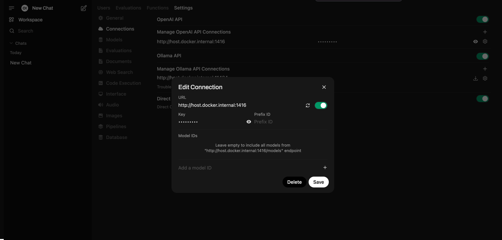

# 🖼️ Multimodal Haystack Agent
This demo shows how to build a multimodal agent that can interact with images and PDFs using [Haystack](https://haystack.deepset.ai/), [Hayhooks](https://github.com/deepset-ai/hayhooks), and [Open WebUI](https://docs.openwebui.com/).

## 🚀 Run the Demo

### 1️⃣ Clone the Repository
```sh
git clone git@github.com:deepset-ai/haystack-demos.git
cd haystack-demos/multimodal_agent
```
### 2️⃣ Install Dependencies(Python>=3.10)
Create and activate a virtual environment (optional but recommended):
```sh
python3.11 -m venv .venv
source .venv/bin/activate
```
Install Haystack, Hayhooks and other required packages:
```sh
pip install haystack-ai python-weather hayhooks
```

### 3️⃣ Configure Environment Variables
Set API Keys:
```sh
export OPENAI_API_KEY=your_openai_api_key # For OpenAI models
```

🔗 **More details on configuration:** [Hayhooks Documentation](https://github.com/deepset-ai/hayhooks?tab=readme-ov-file#configuration)

### 4️⃣ Start the Hayhooks Server 
```sh
hayhooks run
```
Check if Hayhooks is running:
```sh
hayhooks status
```
Output:
```sh
╭─────────────────────────────────────────────────────────────╮
│ Hayhooks server is up and running at: http://localhost:1416 │
╰─────────────────────────────────────────────────────────────╯

No pipelines currently deployed
```

### 5️⃣ Deploy the Agent
Choose the agent that you want to deploy and use the corresponding path:
```sh
hayhooks pipeline deploy-files -n basic-agent multimodal_agent/basic-agent
```

```sh
hayhooks pipeline deploy-files -n agent-with-tool multimodal_agent/agent-with-tool
```
If deployment is successful, you'll see output like this when you run `hayhooks status` again:
```sh
╭─────────────────────────────────────────────────────────────╮
│ Hayhooks server is up and running at: http://localhost:1416 │
╰─────────────────────────────────────────────────────────────╯

        Deployed Pipelines         
╭───┬─────────────────┬───────────╮
│ № │ Pipeline Name   │ Status    │
├───┼─────────────────┼───────────┤
│ 1 │ agent-with-tool │ 🟢 Active │
╰───┴─────────────────┴───────────╯
```

After making changes on the `pipeline_wrapper.py` files, you can redeploy the same agent with the `--overwrite` command without restarting the Hayhooks server.
```sh
hayhooks pipeline deploy-files -n agent-with-tool --overwrite multimodal_agent/agent-with-tool
```

### 6️⃣ Test the API
Swagger docs: [http://localhost:1416/docs](http://localhost:1416/docs)

Test with `curl`:
```sh
curl -X 'POST' \
  'http://localhost:1416/agent-with-tool/run' \
  -H 'accept: application/json' \
  -H 'Content-Type: application/json' \
  -d '{
  "query": "What's the weather like in this place?",
  "image_path": "multimodal_agent/map.png"
}'
```

## 🖥️ Connect to Open WebUI

### 1️⃣ Start Open WebUI
**Official Quick Start:** [Open WebUI Docs](https://docs.openwebui.com/)

Run Open WebUI using Docker:
```sh
docker run -d -p 3000:8080 --add-host=host.docker.internal:host-gateway \
  -e WEBUI_AUTH=False -v open-webui:/app/backend/data \
  --name open-webui ghcr.io/open-webui/open-webui:main
```
⚠️ **Disables authentication.** If you have Open WebUI authentication enabled, delete existing Docker volumes before running this command.

Once running, open: [http://localhost:3000/](http://localhost:3000/). If you're having problems with Open WebUI, remove your browser cache and cookies.

### 2️⃣ Connect Open WebUI to the REST API
1. Go to **Settings** → **Admin Settings** → **Connections** in the Open WebUI
2. Add `http://host.docker.internal:1416` to OpenAI API connections, fill in a placeholder string as "Key" 
3. Select a pipeline as the "model" for chat

