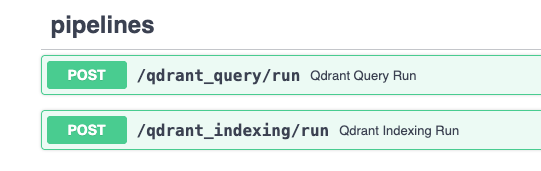

# Qdrant Indexing and Querying using Haystack and Hayhooks

This folder contains an example of how to use [Docker Compose](https://docs.docker.com/compose/) to orchestrate
a simple web application serving two Haystack pipelines using [Hayhooks](https://github.com/deepset-ai/hayhooks), one for *indexing documents* and a second to *query them*,
using [Qdrant](https://github.com/qdrant/qdrant) for storage and retrieval.

## Quickstart

To jump straight into running the demo, clone this repo and cd into the current folder:

```bash
git clone https://github.com/deepset-ai/haystack-demos.git
cd haystack-demos/qdrant_indexing
```

## Pipelines

We have implemented two [pipeline wrappers](https://github.com/deepset-ai/hayhooks?tab=readme-ov-file#why-a-pipeline-wrapper) in the `./pipelines` folder:

- `qdrant_indexing`: This pipeline is used to **index** documents into Qdrant.
- `qdrant_query`: This pipeline is used to **query** documents from Qdrant.

They will be automatically loaded by Hayhooks when it starts.

## Build and run the containers

Run this command to pull the Qdrant Docker image, build the one defined by this demo and run both of them:

```bash
docker-compose up

# or, if you want to run the containers in the background

docker-compose up -d
```

Eventually you should have two containers running, check it out by running:

```bash
docker-compose ps
```

Check if [Hayhooks](https://github.com/deepset-ai/hayhooks) is running by going to [http://localhost:1416/docs](http://localhost:1416/docs#) in your browser.

You should also see the documentation for the two pipelines under the `pipelines` section of docs:



## Inspect the pipelines

To better understand what the two pipelines do, you can visualize their graph using the `/draw/` endpoint. For example,
to visualize `qdrant_indexing` you can point your browser to
[http://localhost:1416/draw/qdrant_indexing](http://localhost:1416/draw/qdrant_indexing).

## Interact with the deployed pipelines

You have two ways to interact with the pipelines:

- Using the Hayhooks CLI
- Using the Hayhooks API

## Index some text using Hayhooks API

To index a file containing some text, we can make a POST request to the `/qdrant_indexing` endpoint:

```bash
curl -X POST http://localhost:1416/qdrant_indexing/run -F "files=@test_file.txt"
```

Upon a successful request, you should get the following JSON response:

```json
{
  "result": {
    "success":true
  }
}
```

## Index some text using Hayhooks CLI

You'll need to install `hayhooks` first:

```bash
pip install hayhooks
```

Then you can run:

```bash
hayhooks pipeline run qdrant_indexing --file test_file.txt
```

This will index the text in the file `test_file.txt` into Qdrant

## Query the indexed text using Hayhooks API

Similarly to indexing, we can query our data by making a POST request to the `/qdrant_query/run` endpoint:

```bash
curl -X "POST" "http://localhost:1416/qdrant_query/run" \
  -H 'Content-Type: application/json; charset=utf-8' \
  -d $'{ "query": "GitHub" }'
```

The response should be something like:

```js
{
  "result": {
    "retriever": {
      "documents": [
        {
          "id": "6b2aec5ac2978cf866a5f27c8fc92e7b06eb9742096093ca238a1fb8309cf139",
          "content": "Alerts are an extension of Markdown used to emphasize critical information. On GitHub, they are displayed with distinctive colors and icons to indicate the importance of the content.",
          // ...
        }
      ]
    }
  }
}
```

## Query the indexed text using Hayhooks CLI

You'll need to install `hayhooks` first:

```bash
pip install hayhooks
```

Then you can run:

```bash
hayhooks pipeline run qdrant_query --param 'query="Github"'
```

*Happy Hacking!*
